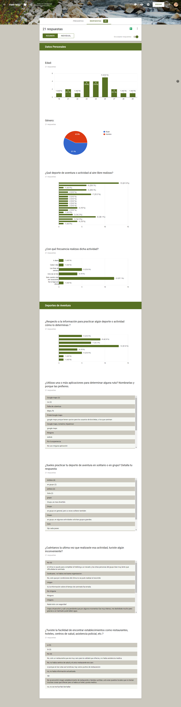
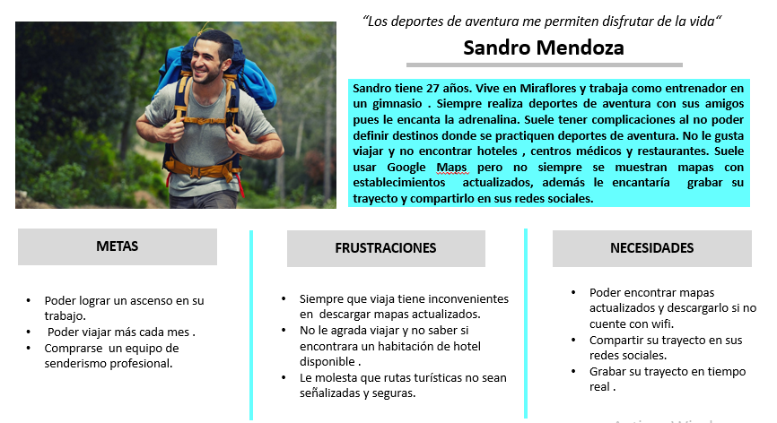

# Reto Here Maps

Es una compañía que desarrolla el servicio de mapas y navegación del mismo nombre. Este servicio (anteriormente Nokia Maps y Ovi Maps) fue creado en un principio para los teléfonos móviles y dispositivos multimedia de Nokia. En la actualidad es propiedad de un consorcio formado por Audi, BMW y Daimler. Here incluye navegación por voz guiada para los peatones y conductores de 74 países en 46 idiomas diferentes y hay mapas para más de 180 países.

Here Maps con su actualización mayor a la versión 2.0 se presenta como una renovación total, estrenando nuevo nombre, nueva interfaz y nuevas formas para desplazarse. Ahora Here Maps se llama Here WeGo.
Here WeGo hace que encontrar rutas y compararlas sea mucho más rápido, al igual que cambiar el tipo de transporte para el desplazamiento. También hace que descubrir lugares cercanos y puntos de interés será más fácil.

##  Equipo de trabajo:

+ Zarate, Claudia
+ Asto, Zulema

## Descripción del reto:

Realizar una aplicación móvil que permita a los usuarios trackear y monitorear recorridos que se realice en senderos al aire libre/outdoor, orientada a los amantes de las actividades de aventura (montañas, lagos, parques, etc.) en Perú.

## Desarrollo:

- Para la resolución del reto seguimos las etapas de DCU (Diseño Centrado en el Usuario) y las herramientas de Design Thinking.

### A. Descubrimiento:

**Actividades**

**1.- RESEARCH**

### Encuesta virtual

Encuesta realizada a 21 personas entre hombres y mujeres.
Conclusiones de la encuesta virtual :

- Nuestros encuestados respondieron que realizan diversas actividades al aire libre y deportes de aventuras:
   - Caminatas el 61.9%
   - Camping el 38.1%
   - Trekking el 33.3%
   - Ciclo-Turismo y Paseos en Automóvil el 28.6%

- La fecuencia en desarrollo de las actividadesy  deportes lo realizan en su mayoria en temporadas de vacaciones y fines de semanas.
- El  determinar la información al escoger algun destino o ruta para destino de aventura  el 61.9% menciona que acuden a sugerencia de amigos.El 42.9% recurre  a una página web.
- El 52.3% usan Google Maps como medio de localización.

**2.- Benchmarking**

Se identificaron plataformas online que ofrecen servicios de información respecto a circuitos y rutas de deportes de aventura. Las principales que se encontraron fueron:

#### Wikiloc:

Esta plataforma permite descubrir diversas rutas para realizar diversas actividades, poder grabar y compartir tus rutas en algunas redes sociales.

#### Relive:

Esta aplicación proporciona grabar tu ruta guardarlas y compartirlas en las redes sociales y conectar su plataforma con otras aplicaciones.

#### Google Maps:

Plataforma que ofrece imágenes de mapas desplazables, así como fotografías por satélite del mundo e incluso la ruta entre diferentes ubicaciones o imágenes a pie de calle con Google Street View.

#### Y tu que planes? :

Promperú y el Ministerio de Comercio Exterior y Turismo (Mincetur) del Perú cuentan con una plataforma y a través de esta página uno puede armar sus viajes de acuerdo a sus intereses, si es un viaje de un día, un viaje de dos o de tres días, si quiero ir a costa, sierra o a la selva, si tengo interés en ver arqueología, naturaleza, observación de aves o hacer turismo rural comunitario.
La información proporcionada muestra los lugares turisticos relevantes y seguros del Peú.

### B. Síntesis y definición

**Actividades**

**1.- Definición del problema: Diagrama de afinidad y Lluvia de ideas**

Mediante el diagrama de afinidad se identifió diferentes items de acuerdo a los requerimientos para clasificar los problemas a resolver.
Los items fueron:

- Información de Destinos o Rutas.
- Establecimientos(Hoteles-Restaurantes-Centro de Salud)
- Frecuencia
- Actividades(Deportes)
- Uso de aplicaciones.
- Inconvenientes

**2.- Priorización de los items encontrados**

Mediante una lluvia de ideas entre el usuario y el equipo se priorizaron los siguientes requerimientos:

- Información de Destinos o Rutas.
- Establecimientos(Localización de Hoteles-Restaurantes-Centro de Salud)
- Actividades(Deportes)

**3.- Elección del problema**

Proporcionar una plataforma que brinde a los usuarios amantes de diversas actividades al aire libre y deportes de aventura ,la disponibilidad de mapas, información de establecimientos cercanos y poder publicar a tiempo real en sus redes sociales.

**4.- Definición del user persona**

Se difinició un user persona principal.

Se difinició un user persona secundario.

### C. Prototipado

**Actividades**

**1.- Realización del Content Prototype**

- Realización del content prototype del flujo del MVP. Se intentó replicar la interacción del usuario con la plataforma de registro de proyectos y como se daría el seguimiento.

[Content Prototyping]()

**Testing con el cliente**
 -

 **2.- Paper Prototype**

 Luego del testeo del content prototype, realizó el prototipo del producto en papel definir mejor el flujo y el número de vistas.

**Inicio de sesión**

.
.
.

### D. Iteración y Síntesis:

### F. Flujo de la aplicación.

### E. Herramientas utilizadas:

- Diseño Centrado en el Usuarios
- Design Thinking
- Figma
- Marvel
